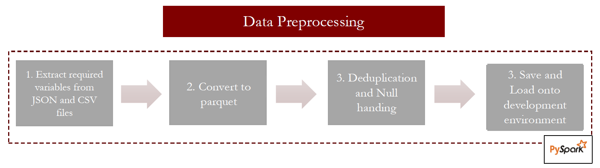
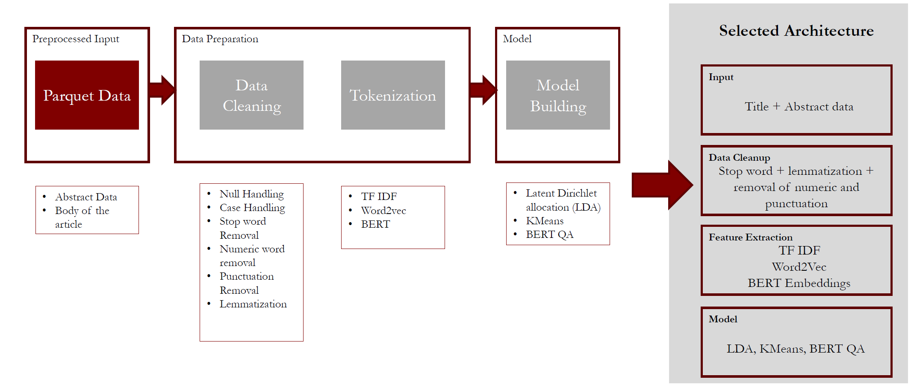
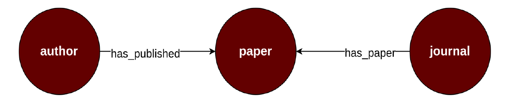
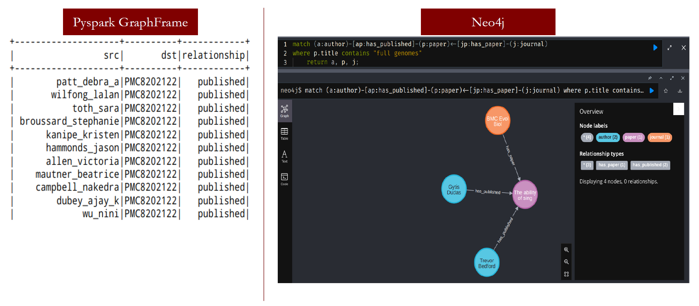
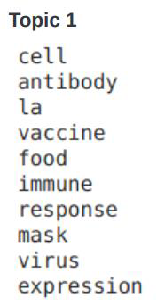
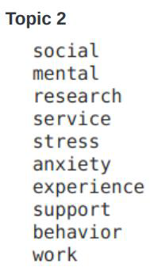
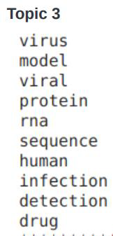

# COVID-19 Literature Analysis using Machine Learning and Deep Learning

## Table of contents
1. [Introduction](#intro)
2. [Dataset Description](#dataset)
3. [Methodology](#method)
4. [Graph Database](#graph)
5. [Results](#results)

## Introduction 
The coronavirus pandemic caused enormous health, economic, environmental, and social challenges to the entire human population. The entire research community worked tirelessly for a vaccine but could we help speeding up these efforts even more?

In response to the COVID-19 pandemic, the White House and a coalition of leading research groups prepared a COVID-19 Open Research Dataset (CORD-19). It is a resource of over 1 million scholarly articles, including over 400,000 with full text, about COVID-19, SARS-CoV-2, and related coronaviruses. This freely available dataset was provided to the global research community to apply recent advances in natural language processing and other AI techniques to generate new insights in support of the ongoing fight against this infectious disease.

This project aims to help researchers navigate this fast-growing body of coronavirus literature to efficiently find relevant and up-to-date information. This is done by using various topic modeling algorithms to cluster similar papers together. We leverage Hadoop for data storage management and PySpark for building ML and DL pipelines.

## Dataset Description 
Dataset consists of JSON and CSV files. Each paper is saved in a nested JSON file while some additional metadata is available in a CSV file. A detailed description is available [here](https://www.kaggle.com/datasets/allen-institute-for-ai/CORD-19-research-challenge). Below image summarizes the data preprocessing pipeline.

## Methodology 

## Graph Database 
- Graph databases provide a way to generate and visualize relationships between entities
- Both Pyspark GraphFrame and neo4j can achieve graph-based data storage. We explored both the tools
- Each author, paper, and journal acts as a node
- All nodes are connected as per relationships – “has_published” or “has_paper”
- Data was prepared using python to make it ready to import to neo4j
- Docker was used to install the neo4j (neo4j version 5.2.0)
- Bash script (start_neo4j.sh) starts the docker container, neo4j server and imports the data

## Results 
Below are a few sample results of topic modeling

  

- Topic 1 seem to be concerned with immune response and antibodies
- Topic 2 seem to be talking about effects of pandemic on society, mental health (stress, anxiety) and work environment (behavior, support)
- Topic 3 papers could be related to infection detection, antibody sequencing and virus itself
